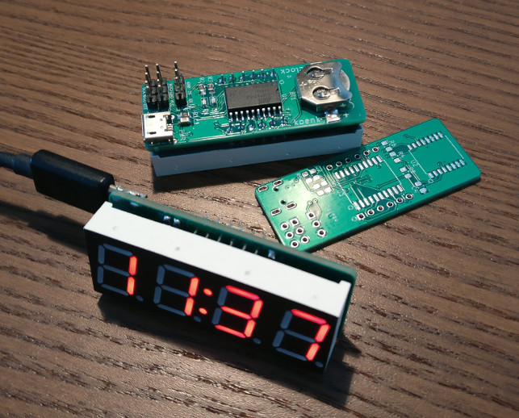
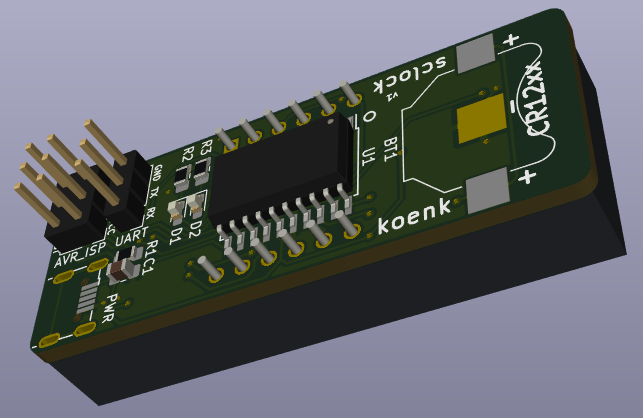

# SimpleClock

A small USB powered clock with 7-segment display.

This clock is designed to be minimal, only capable of showing the current time.
The PCB with all components is the same size as the 4x7-segment display itself,
making the fully assembled clock as big as a 4x7-segment display with its pins.

The clock has a micro-usb connector for power, a header for programming the
(AVR) microcontroller, and a header for serial I/O. The clock has no buttons or
other physical inputs; the time is programmed using the serial I/O with
a computer. The brightness of the display can also be configured this way.

A battery-backed RTC keep track of time even when the clock is not plugged into
a 5V power source. The display and MCU are only powered when a 5V source is
connected (normally, via the micro-usb port).

The `pcb` folder contains KiCad files for the schema and PCB design. The `src`
folder contains the code for the microcontroller, which can be built and flashed
using `make install` in the `src` directory. The `control.py` script
communicates with the clock over a serial connection; see `control.py -h` for
all available operations.

